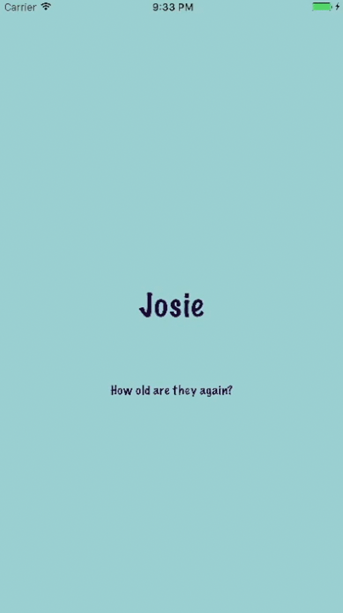

#  Josie & Jack

## :family: Summary
* Quick iOS app to help me remember my friend's kid's birthdays.
* Converts units from new-parent lingo. (17 months -> 1 year, 5 months.)
* Simply stores a name and date locally on the device with Core Data.

  

## :baby: Version

* Pre-release / experimental

## :construction_worker: How do I get set up?

* Pull down this project and use Xcode to build and run.
* There are no dependencies; just run it.

## :eyes: Points of interest
### splash screen
* Since you cannot animate a splash screen, I implemented a workaround.
* To give the appearance of the splash screen dropping off the bottom when it loaded, I transition from splash to an identical view and do the animation there.

### two paths
* If the user has stored < N birthdays, they display in a bouncy stack view.
* Otherwise, they display in a tableview.
* I didn't want to display a sad and lonely tableview with very few items.

## :clipboard: Future plans

* Detail view so user can store notes. ("Jack loves astronauts :rocket:.") --> Done! 
* Notifications for bday reminders.
* Geolocation region monitoring with location-based notifications. ("Looks like you are near Fred Flintstone's house. Pebbles is 8 months now.")
